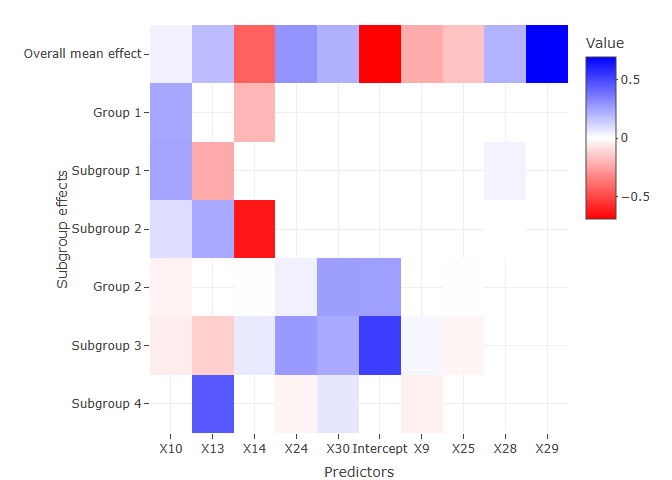
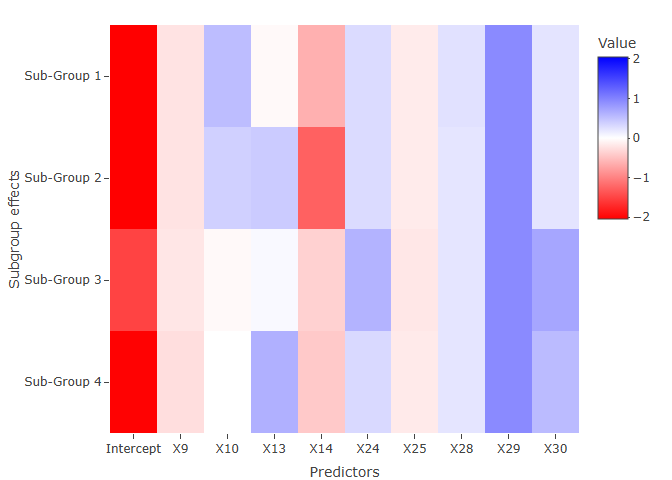

Simple guidance on hierNest package
================
2025-11-03

# Load example data

``` r
library(hierNest)
```

    ## 载入需要的程辑包：rTensor

    ## 载入需要的程辑包：plotly

    ## 载入需要的程辑包：ggplot2

    ## 
    ## 载入程辑包：'plotly'

    ## The following object is masked from 'package:ggplot2':
    ## 
    ##     last_plot

    ## The following object is masked from 'package:stats':
    ## 
    ##     filter

    ## The following object is masked from 'package:graphics':
    ## 
    ##     layout

``` r
data=readRDS("./example_data.Rdata")
```

# Run cross-validation

``` r
cv.fit=cv.hierNest(data$X,
                   data$Y,
                   method="overlapping",# For now, we only wrap-up the overlapping group lasso method in this function
                   hier_info=data$hier_info,
                   family="binomial",
                   partition = "subgroup", # partition = "subgroup" make sure the each n-fold is sampled within the subgroups to avoid extreme cases
                   cvmethod = "grid_search", # cvmethod = "grid_search" indicate the second cross-validation method
                   asparse1 = c(0.5,20), # Input the upper and lower bounds of alpha_1 and alpha_2
                   asparse2 = c(0.05,0.20), 
                   asparse1_num = 3, # number of grids for alpha_1 and alpha_2, total 3*3 = 9 grids will be screened
                   asparse2_num = 3, 
                   nlambda = 50, # length of lambda sequence for each pair of alpha_1 and alpha_2
                   )
```

# Results

## Plot the coefficients

By specifying the type = “coefficients”, we plot all non-zero
coefficient including the overall mean, group-specific, and subgroup
specific.

``` r
plot(cv.fit, type = "coefficients")
```

<!-- -->

By specifying the type = “Subgroup effect”, we plot the covaraite
effects for each subgroup.

``` r
plot(cv.fit, type = "Subgroup effects")
```

<!-- -->

## Grab chosen lambda and coefficients

``` r
cv.fit$lambda.min    # lambda minimizing CV loss
```

    ## [1] 0.0005147827

``` r
cv.fit$min_alpha1    # alpha1 minimizing CV loss
```

    ## [1] 0.5

``` r
cv.fit$min_alpha2    # lambda minimizing CV loss
```

    ## [1] 0.2
